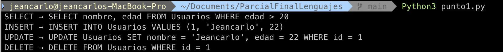

## Punto 1 

Para el punto uno se desarrolló una función que genera una gramática de atributos para un Lenguaje de programación que realice consultas de tipo SQL, este punto fue desarrollado en Python con funciones de sql básicas como select, insert, update, delete en una base de datos donde se hace uso de claves como where, set, from. Etc...
Se consideró una gramática de atributos que se presenta en el siguiente árbol

    Select.trad
        /      |      \
  Campos.trad  "Usuarios"  Condicion.trad
     /    \                      |
"nombre" RCampos.trad      Expr.trad
            |               "edad > 20"
         ", edad"

