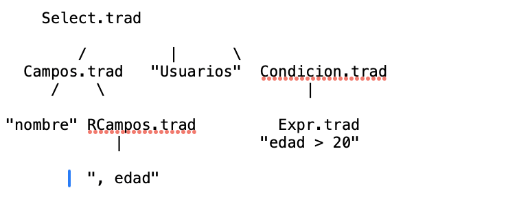
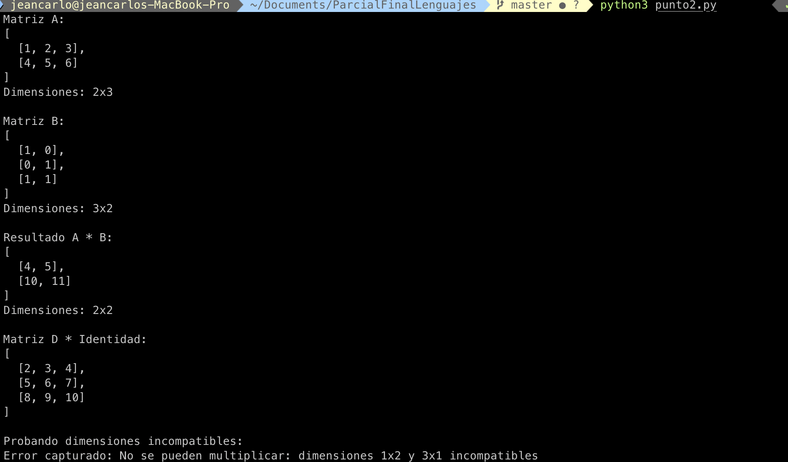

## Punto 1 

Para el punto uno se desarrolló una función que genera una gramática de atributos para un Lenguaje de programación que realice consultas de tipo SQL, este punto fue desarrollado en Python con funciones de sql básicas como select, insert, update, delete en una base de datos donde se hace uso de claves como where, set, from. Etc...
Se consideró una gramática de atributos que se presenta en el siguiente árbol

## Punto 2

Este proyecto implementa un sistema de multiplicación de matrices utilizando el concepto de gramática de atributos. Se desarrollaron dos versiones: la primera sigue estrictamente el patrón de traducción dirigida por sintaxis. El código incluye validación de dimensiones, manejo de errores y ejemplos prácticos de uso, demostrando tanto los fundamentos teóricos de las gramáticas de atributos como su aplicación práctica en el procesamiento de estructuras de datos matriciales

